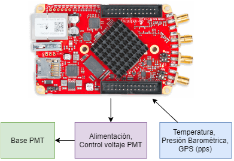
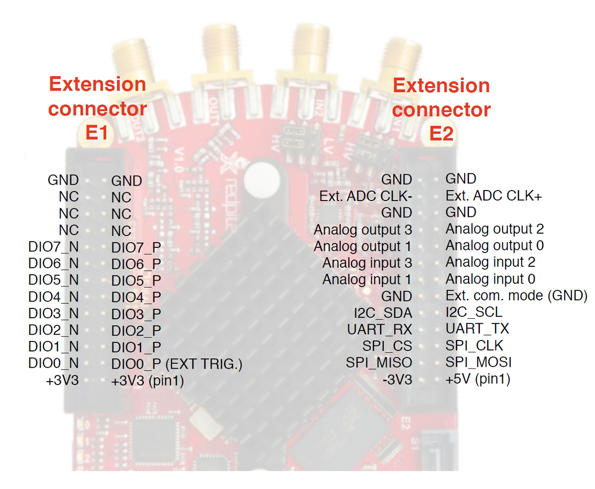
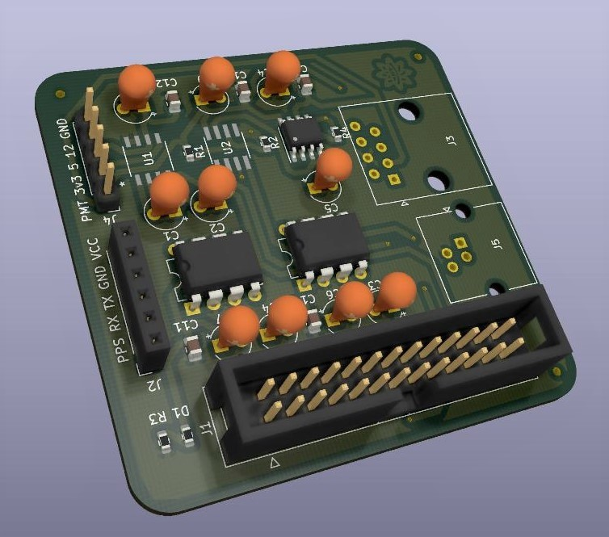

# HARDWARE PARA LAGO USAC CON RED PITAYA
Este proyecto recopila los avances realizados por [Escaramujo Project and LAGO Project matching hardware ](https://github.com/ECFM-USAC/EscaramujoLagoMatch), realizando cambios en el diseño de la PCB.

## Descripción
El diseño busca controlar el voltaje de alimentación para la placa de la base de un PMT Photonix, obteniendo la linea de alimentación principal de la Red Pitaya, a su vez enviar información de temperatura, presión barométrica y GPS. 

Dado a que el tipo de voltaje necesitado por la base del PMT debe de ser lineal, la placa debe de proveer los siguientes voltajes:
* 5 VDC (MAX604)
* 3.3 VDC (MAX603)
* 12 VDC 
* 0 - 5 VDC variable
Esta placa se conecta a la base del PMT por medio de un conector RJ45.

Con base en el pinout de la Red Pitaya se utiliza los *pines IDE extension connector*

La alimentación de la placa se obtiene del pin +5V.

Se utiliza el modulo BMP180 para la medición de presión barométrica y temperatura, conectado a la Red Pitaya por medio un conector RJ11 utilizando el protocolo de comunicación I2C, con los pines: I2C_SDA y I2C_SCL.

Se utiliza el modulo NEO-6M GPS, conectado por medio de HEADERS IDC y hacia la Red Pitaya por medio de UART_RX, UART_TX y DIO1_N.

Para el control del voltaje se utilizan los pines SPI_CS, SPI_CLK y SPI_MOSI.

[Este es el esquemático del proyecto en formato pdf](Imagenes/esquematico.pdf), también pueden consultarse los editables en la carpeta HARDWARE.

## Resultado final
El diseño del circuito y la PCB se realizaron en el software KiCad. Se muestra el modelo final de la PBC.

Dentro de la carpeta Gerber, se encuentra el gerber de cada parte del PCB y dentro de la carpeta CNC_code se encuentra el código para CNC elaborado en el software **FlatCAM**.

